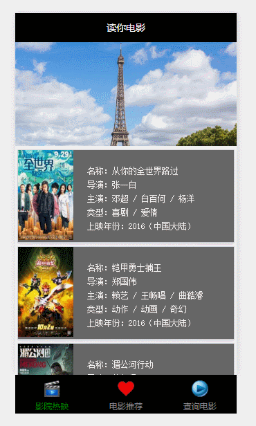

# wxapp-movie
微信小程序-读你电影（豆瓣API）

**2016-10-15更新：**豆瓣API借口更换为https,如过之前clone的出现获取不到豆瓣API的请重新clone一下

## 功能
查询影院热映、推荐电影、查询电影和查看电影详情页面（查看详情还没做）

## 涉及内容
网络通信、豆瓣电影接口、模板、页面引用、js封装引用、wxss引用、text、image、swiper、loding、modal、input、button、tabBar

